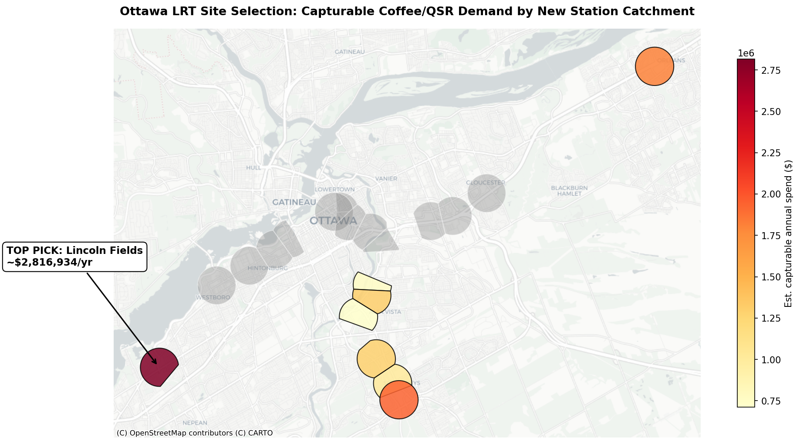

# Ottawa LRT Site Selection

**Which newly opened Ottawa LRT station catchment should a coffee/QSR chain prioritize for its next location?**

This project assembles public data from several separate sources to answer that question with a specific site recommendation and an estimated dollar figure, rather than a general chart.

## Recommendation

**Prioritize Lincoln Fields** — an estimated **$2.8M in annual capturable food-services spend**, the highest of any newly opened LRT catchment and the cleanest current coffee gap among the top candidates. The ranking was verified against 2026 building permits and direct competitor checks, which reshuffled the shortlist (Place d'Orléans has a café under construction; South Keys has a nearby Starbucks).

See [memo.md](memo.md) for the full recommendation.

## Why This Question

Ottawa's LRT network expanded in 2025, creating concentrated pedestrian demand at stations that existing chains have not yet responded to. This analysis finds where resident demand most outpaces existing competition, which is exactly where the new stations sit.

## Data Sources

None of this existed as a ready-made dataset. It was assembled from:

- **OC Transpo / Open Ottawa** — LRT station locations
- **Statistics Canada 2021 Census** — dissemination-area population, joined onto boundary shapes
- **OpenStreetMap (Overpass API)** — ~1,000 live competitor locations
- **City of Ottawa building permits (2026)** — development pipeline check
- **StatCan Survey of Household Spending 2023** — per-household food-services spend

## Method

1. Built non-overlapping walkable catchments per station (nearest-station territories, capped at a 10-minute walk) to avoid double-counting residents.
2. Estimated demand from 2021 census population, apportioned by overlap area.
3. Pulled competitor locations and weighted them by brand strength.
4. Applied a **Huff gravity model** to estimate each site's capturable demand against existing competition.
5. Validated the model against revealed competitor locations and saturation patterns.
6. Converted captured demand to dollars using StatCan household spending data.
7. Adjusted the shortlist using 2026 building permits and direct competitor verification — which changed the ranking.

## What Changed the Ranking

The most important finding is that the shortlist evolved once the model output was stress-tested:

- **Lincoln Fields** — highest modeled demand, no incoming competition, nearest coffee competitor ~1.4km away. Stable rather than fast-growing catchment.
- **Place d'Orléans** — currently no coffee competitors, but a bakery/café is under construction at the station. The gap is closing.
- **South Keys** — 144 new dwelling units under construction and no incoming competition, but an existing Starbucks 364m from the station makes it the most contested coffee site today.

## Limitations

Figures are estimates built on stated assumptions and represent a defensible relative ranking rather than precise revenue forecasts. The top site's absolute capture share is optimistic and would be tempered with a chain's own sales data. The recommendation was verified against both the development pipeline and current competitor locations.

## Files

- `notebook.ipynb` — the full analysis
- `memo.md` — the recommendation memo
- `ottawa_site_selection_map.png` — the summary map
